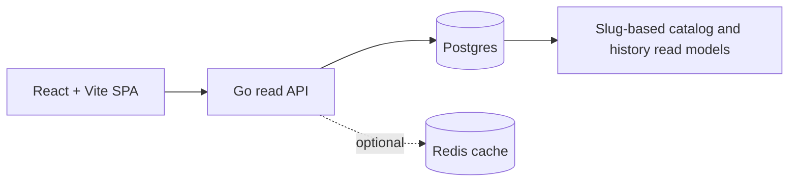

<div align="center">
  
  <h1>Deskovky Levně</h1>
  <p>A board-game price comparison app with per-store price history.</p>
  <p>
    <a href="https://www.deskovkylevne.com/">Live website</a> |
    <a href="docs/README.md">Documentation</a> |
    <a href="README.md">Česky</a>
  </p>
</div>

## Screenshot

<p align="center">
  
</p>

## About

Deskovky Levně aggregates prices, availability, and historical data from Czech
board-game retailers. Its public catalog unifies products under canonical slugs
while preserving offers and price history separately for every store. This makes
it possible to compare current prices and their actual development without
merging different sellers into one synthetic series.

The project is built as a production-oriented full-stack application with a
separate frontend, read API, database read models, optional caching, and an SEO
build pipeline.

## Key features

- Board-game search by name, alias, or retailer product code.
- Catalog filtering by price, availability, discount, category, player count,
  playtime, and minimum age.
- Product detail pages with a gallery, current retailer offers, and price
  statistics.
- Price history with an independent time series for every available seller.
- Czech and English user interfaces.
- SEO metadata, sitemap generation, and prerendered HTML for public routes.

## How it works

1. Imported snapshots store prices, availability, and related facts separately
   for each retailer.
2. A database refresh maps products to canonical slugs and produces incremental
   read models for the catalog and per-seller daily history.
3. The Go API reads the prepared models from PostgreSQL and can cache responses
   in Redis. Public product routes use slugs rather than internal product codes.
4. The React application uses the API to render the catalog, search, product
   details, retailer offers, and parallel price series. The build also generates
   a sitemap and static SEO previews.

## Architecture



- **Frontend:** React, TypeScript, and Vite in `src/`.
- **Backend:** Go service in `apps/api-go`, exposing `/api/v1/*` endpoints.
- **Data:** PostgreSQL/Supabase as the source of truth, with read models for the
  catalog, offers, and per-seller history.
- **Cache:** optional Redis caching for frequently read API responses.
- **Build:** TypeScript build, sitemap generation, Vite bundle, and prerendering.

See the [architecture overview](docs/architecture/overview.md) for details.

## Technology stack

| Layer | Technology |
| --- | --- |
| Frontend | React 19, TypeScript, Vite, Tailwind CSS, Lucide, Recharts |
| Backend | Go 1.26, Chi, pgx |
| Data | PostgreSQL, Supabase, slug- and seller-level read models |
| Cache | Redis, singleflight cache-miss coalescing |
| Testing | Node test runner, Playwright, Go tests with the race detector |
| Deployment | Vite, prerendering, Docker, nginx |

## Local setup

You need Node.js with npm, Go 1.26, and a PostgreSQL database containing the
project read models.

1. Install the JavaScript dependencies:

   ```bash
   npm install
   ```

2. Create `apps/api-go/.env` from `apps/api-go/.env.example` and set at least
   `DATABASE_URL`.

3. Start the frontend and API together:

   ```bash
   npm run dev
   ```

You can also run the layers separately:

```bash
npm run dev:frontend
npm run api:dev
```

Environment variables and their defaults are documented in the
[configuration reference](docs/operations/configuration.md).

## Tests and quality checks

Install the Playwright Chromium browser before running E2E tests for the first
time:

```bash
npx playwright install chromium
```

Frontend and repository checks used in CI:

```bash
npm run lint
npm run security:sql
npm run test:unit
npm run build
npm run test:e2e
```

Go API checks:

```bash
cd apps/api-go
go test -race ./...
go vet ./...
```

The `npm test` command runs the unit and E2E suites in sequence.

## Documentation

The `docs/` directory is the canonical, English-first source of documentation
for the project's current behavior:

- [Documentation hub](docs/README.md)
- [Architecture](docs/architecture/overview.md)
- [Product model](docs/domain/product-model.md)
- [HTTP API contract](docs/api/http-api.md)
- [Frontend runtime](docs/frontend/runtime.md)
- [Build and deployment](docs/operations/build-and-deploy.md)
- [Configuration](docs/operations/configuration.md)
- [Data refresh](docs/operations/data-refresh.md)
- [Documentation standards](docs/contributing/documentation-standards.md)
