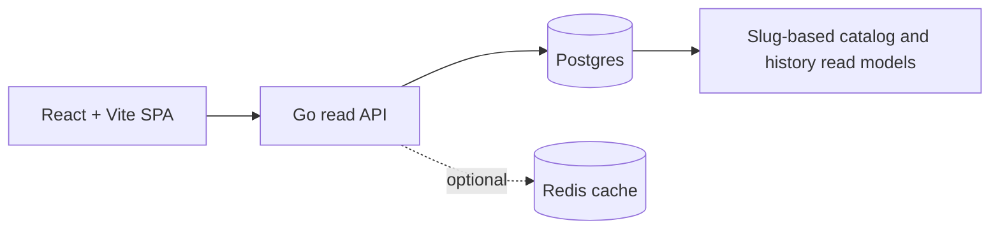

<div align="center">
  
  <h1>Deskovky Levně</h1>
  <p><strong>A board-game price comparison app with per-store price history.</strong></p>

  <p>
    <a href="https://www.deskovkylevne.com/"></a>
    <a href="https://react.dev/"></a>
    <a href="apps/api-go/README.md"></a>
    <a href="docs/README.md"></a>
  </p>

  <p>
    <a href="https://www.deskovkylevne.com/">Live demo</a> |
    <a href="README.md">České README</a> |
    <a href="docs/README.md">Documentation</a>
  </p>

  
</div>

## Why this project is interesting

- Solves a real product problem: aggregates prices, availability, and historical
  data from multiple Czech board-game retailers.
- Uses a slug-first domain model, so public routes are not coupled to individual
  sellers' internal product codes.
- Keeps price history separate per seller and never flattens it into one
  synthetic chart line.
- Separates the React frontend, Go read API, Postgres read models, and optional
  Redis cache for a fast runtime layer.
- Covers production details: SEO metadata, sitemap generation, prerendering,
  explicit not-found routes, API client retries, and documented deployment.

## Features

- Board-game search by name, aliases, and seller product codes.
- Catalog filtering by price, availability, categories, player count, playtime,
  age rating, and discounts.
- Product detail pages with hero gallery, seller offers, and price-history chart.
- Multi-seller price history where every store remains a separate time series.
- Czech and English UI localization.

## Architecture



- The frontend is a React + Vite + TypeScript SPA.
- The Go backend exposes `/api/v1/*` endpoints for catalog, search, product
  detail, filter metadata, and recent snapshots.
- Runtime catalog reads primarily from `catalog_slug_state`; seller-level data
  and history remain separated in seller read models.
- The build pipeline generates the sitemap, builds the Vite bundle, and
  prerenders static HTML for stronger SEO.

More details are available in the
[architecture overview](docs/architecture/overview.md) and
[HTTP API contract](docs/api/http-api.md).

## Tech stack

| Layer | Technology |
| --- | --- |
| Frontend | React 19, TypeScript, Vite, Tailwind CSS, Recharts |
| Backend | Go read API, route timeouts, request cancellation |
| Data | Postgres read models, per-seller history |
| Cache | Optional Redis cache with singleflight cache-miss coalescing |
| Quality | ESLint, Playwright E2E, TypeScript build |
| Deploy | Vite build, prerender, Go API container, nginx reverse proxy |

## Local development

```bash
npm install
npm run dev
```

Run layers separately:

```bash
npm run dev:frontend
npm run api:dev
```

Tests and build:

```bash
npm run lint
npm test
npm run build
```

Environment configuration is documented in
[operations/configuration.md](docs/operations/configuration.md). The Go API
requires `DATABASE_URL` for real data; the frontend uses `VITE_API_BASE_URL` or
the local proxy when running `npm run dev`.

## Documentation

`docs/` is the canonical source of documentation for current project behavior:

- [Architecture overview](docs/architecture/overview.md)
- [Product domain model](docs/domain/product-model.md)
- [HTTP API contract](docs/api/http-api.md)
- [Frontend runtime](docs/frontend/runtime.md)
- [Build and deploy](docs/operations/build-and-deploy.md)
- [Configuration](docs/operations/configuration.md)
- [Data refresh operations](docs/operations/data-refresh.md)

## What this project demonstrates

This repository demonstrates the ability to take a full-stack product beyond a
prototype: domain modeling, API contracts, frontend UX, performance-oriented
read paths, SEO build pipeline, operational documentation, and a testable code
structure.
