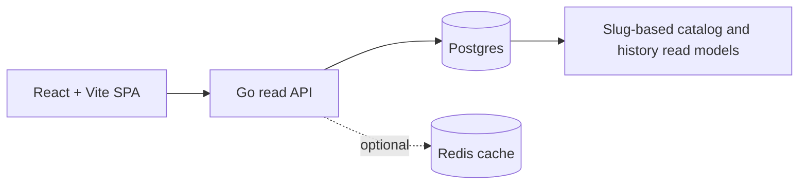

<div align="center">
  
  <h1>Deskovky Levně</h1>
  <p><strong>Srovnávač cen deskových her s historií cen po jednotlivých obchodech.</strong></p>

  <p>
    <a href="https://www.deskovkylevne.com/"></a>
    <a href="https://react.dev/"></a>
    <a href="apps/api-go/README.md"></a>
    <a href="docs/README.md"></a>
  </p>

  <p>
    <a href="https://www.deskovkylevne.com/">Live demo</a> |
    <a href="README.en.md">English README</a> |
    <a href="docs/README.md">Dokumentace</a>
  </p>

  
</div>

## Proč je projekt zajímavý

- Řeší reálný produktový problém: agreguje ceny, dostupnost a historická data z
  více českých obchodů s deskovými hrami.
- Používá slug-first doménový model, takže veřejné routy nejsou závislé na
  interních kódech jednotlivých sellerů.
- Uchovává historii cen po sellerech odděleně a v grafech ji nezplošťuje do
  jedné syntetické řady.
- Má oddělený React frontend, Go read API, Postgres čtecí modely a volitelnou
  Redis cache pro rychlou runtime vrstvu.
- Řeší i produkční detaily: SEO metadata, sitemap, prerendering, explicitní
  not-found routy, retry logiku API klienta a dokumentovaný deploy.

## Co aplikace umí

- Vyhledávání deskových her podle názvu, aliasů a seller kódů.
- Katalog s filtrováním podle ceny, dostupnosti, kategorií, počtu hráčů, délky
  hry, věku a slev.
- Detail produktu s hero galerií, nabídkami sellerů a grafem historie cen.
- Vícesellerovou historii cen, kde každý obchod zůstává samostatná časová řada.
- Českou i anglickou lokalizaci uživatelského rozhraní.

## Architektura



- Frontend běží jako React + Vite + TypeScript SPA.
- Backend v Go vystavuje `/api/v1/*` endpointy pro katalog, search, produktový
  detail, metadata filtrů a recent snapshoty.
- Runtime katalog čte primárně z `catalog_slug_state`; data a historie na
  úrovni sellerů zůstávají oddělené v samostatných čtecích modelech.
- Build pipeline generuje sitemapu, sestaví Vite bundle a prerenderuje statické
  HTML pro lepší SEO.

Více detailů je v [architecture overview](docs/architecture/overview.md) a
[HTTP API contract](docs/api/http-api.md).

## Tech stack

| Vrstva | Technologie |
| --- | --- |
| Frontend | React 19, TypeScript, Vite, Tailwind CSS, Recharts |
| Backend | Go read API, route timeouts, request cancellation |
| Data | Postgres čtecí modely, historie po sellerech |
| Cache | Volitelná Redis cache se spojováním souběžných cache miss požadavků |
| Kvalita | ESLint, Playwright E2E, TypeScript build |
| Nasazení | Vite build, prerender, Go API container, nginx reverse proxy |

## Lokální vývoj

```bash
npm install
npm run dev
```

Samostatné spuštění vrstev:

```bash
npm run dev:frontend
npm run api:dev
```

Testy a build:

```bash
npm run lint
npm test
npm run build
```

Konfigurace prostředí je popsaná v
[operations/configuration.md](docs/operations/configuration.md). Go API vyžaduje
pro reálná data `DATABASE_URL`; frontend používá `VITE_API_BASE_URL`, případně
lokální proxy při `npm run dev`.

## Dokumentace

`docs/` je kanonický zdroj dokumentace pro aktuální chování projektu:

- [Architecture overview](docs/architecture/overview.md)
- [Product domain model](docs/domain/product-model.md)
- [HTTP API contract](docs/api/http-api.md)
- [Frontend runtime](docs/frontend/runtime.md)
- [Build and deploy](docs/operations/build-and-deploy.md)
- [Configuration](docs/operations/configuration.md)
- [Data refresh operations](docs/operations/data-refresh.md)

## Co tento projekt ukazuje

Tento repozitář ukazuje schopnost navrhnout a dotáhnout full-stack produkt za
hranici prototypu: doménové modelování, API kontrakty, frontend UX, výkonovou
vrstvu, SEO build pipeline, provozní dokumentaci a testovatelnou strukturu kódu.
