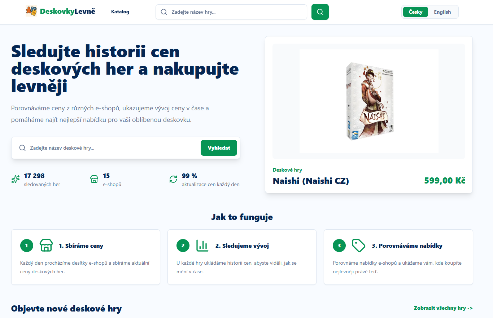
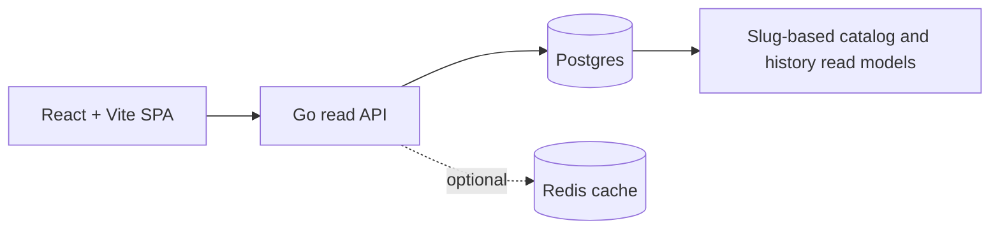

<div align="center">
  
  <h1>Deskovky Levně</h1>
  <p>Srovnávač cen deskových her s historií cen po jednotlivých obchodech.</p>
  <p>
    <a href="https://www.deskovkylevne.com/">Živý web</a> |
    <a href="docs/README.md">Dokumentace</a> |
    <a href="README.en.md">English</a>
  </p>
</div>

## Screenshot

<p align="center">
  
</p>

## O projektu

Deskovky Levně agregují ceny, dostupnost a historická data z českých obchodů
s deskovými hrami. Veřejný katalog sjednocuje produkty pomocí kanonických slugů,
ale nabídky a cenovou historii zachovává odděleně pro každý obchod. Díky tomu lze
porovnat aktuální ceny i jejich skutečný vývoj bez slučování různých sellerů do
jedné syntetické řady.

Projekt je navržený jako produkční full-stack aplikace se samostatným frontendem,
read API, databázovými čtecími modely, volitelnou cache a SEO build pipeline.

## Hlavní funkce

- Vyhledávání deskových her podle názvu, aliasu nebo produktového kódu obchodu.
- Katalog s filtrováním podle ceny, dostupnosti, slevy, kategorie, počtu hráčů,
  délky hry a minimálního věku.
- Detail produktu s galerií, aktuálními nabídkami obchodů a cenovými statistikami.
- Historie cen se samostatnou časovou řadou pro každého dostupného sellera.
- České a anglické uživatelské rozhraní.
- SEO metadata, sitemap a předrenderované HTML pro veřejné routy.

## Jak projekt funguje

1. Importované snapshoty uchovávají cenu, dostupnost a další údaje samostatně pro
   každý obchod.
2. Databázová aktualizace přiřadí produkty ke kanonickému slugu a vytvoří
   inkrementální čtecí modely katalogu a denní historie po sellerech.
3. Go API čte připravené modely z PostgreSQL a může odpovědi ukládat do Redis
   cache. Veřejné produktové routy používají slug, nikoli interní produktový kód.
4. React aplikace z API sestaví katalog, vyhledávání, detail produktu, nabídky
   obchodů a paralelní cenové řady. Build navíc generuje sitemapu a statické SEO
   náhledy.

## Architektura



- **Frontend:** React, TypeScript a Vite v `src/`.
- **Backend:** Go služba v `apps/api-go`, která vystavuje endpointy `/api/v1/*`.
- **Data:** PostgreSQL/Supabase jako zdroj pravdy a čtecí modely pro katalog,
  nabídky a historii po sellerech.
- **Cache:** volitelný Redis pro často čtené odpovědi API.
- **Build:** TypeScript build, generování sitemapy, Vite bundle a prerendering.

Podrobnosti popisuje [přehled architektury](docs/architecture/overview.md).

## Použité technologie

| Vrstva | Technologie |
| --- | --- |
| Frontend | React 19, TypeScript, Vite, Tailwind CSS, Lucide, Recharts |
| Backend | Go 1.26, Chi, pgx |
| Data | PostgreSQL, Supabase, čtecí modely po slugu a sellerovi |
| Cache | Redis, singleflight spojování souběžných cache miss požadavků |
| Testy | Node test runner, Playwright, Go testy s race detectorem |
| Nasazení | Vite, prerendering, Docker, nginx |

## Lokální spuštění

Potřebujete Node.js s npm, Go 1.26 a PostgreSQL databázi s projektovými čtecími
modely.

1. Nainstalujte JavaScriptové závislosti:

   ```bash
   npm install
   ```

2. Vytvořte `apps/api-go/.env` podle `apps/api-go/.env.example` a nastavte v něm
   alespoň `DATABASE_URL`.

3. Spusťte frontend a API společně:

   ```bash
   npm run dev
   ```

Vrstvy lze spustit také samostatně:

```bash
npm run dev:frontend
npm run api:dev
```

Proměnné prostředí a jejich výchozí hodnoty jsou v
[konfigurační dokumentaci](docs/operations/configuration.md).

## Testy a kontrola kvality

Před prvním spuštěním E2E testů nainstalujte Chromium pro Playwright:

```bash
npx playwright install chromium
```

Frontendové a repozitářové kontroly používané v CI:

```bash
npm run lint
npm run security:sql
npm run test:unit
npm run build
npm run test:e2e
```

Kontroly Go API:

```bash
cd apps/api-go
go test -race ./...
go vet ./...
```

Příkaz `npm test` spustí unit a E2E testy za sebou.

## Dokumentace

Adresář `docs/` je kanonický, anglicky vedený zdroj dokumentace aktuálního
chování projektu:

- [Rozcestník dokumentace](docs/README.md)
- [Architektura](docs/architecture/overview.md)
- [Produktový model](docs/domain/product-model.md)
- [HTTP API kontrakt](docs/api/http-api.md)
- [Frontend runtime](docs/frontend/runtime.md)
- [Build a nasazení](docs/operations/build-and-deploy.md)
- [Konfigurace](docs/operations/configuration.md)
- [Aktualizace dat](docs/operations/data-refresh.md)
- [Pravidla dokumentace](docs/contributing/documentation-standards.md)
